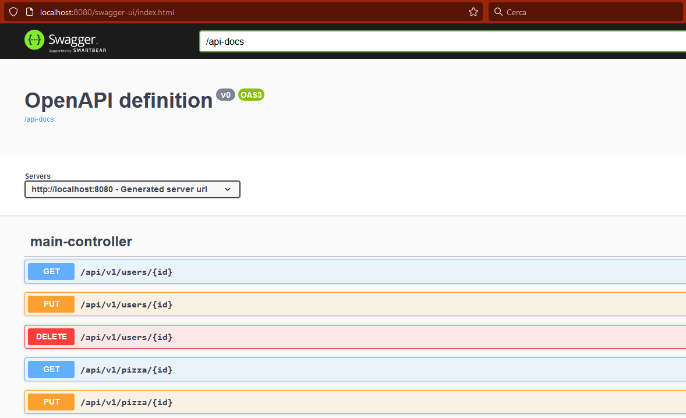
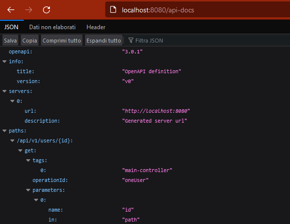

# Awesome-Pizza restApi: A Pizza Order Management System with Spring Framework

## Table of Contents
* [Introduction](#introduction)
* [Technologies Used](#built-with)
* [Setup](#setup)
* [Usage](#usage)
    * [Curl](#curl)
    * [Swagger](#swagger)
 * [Guidelines](#guidelines)

## Introduction
Awesome-Pizza is a pizza order management system built using Spring Framework. It allows you to create, read, update and delete pizza orders, as well as retrieve information about pizzas and users.

## Built with
Awesome-Pizza uses the following tools to work properly:
 
- [Docker]: A platform for developers to develop, deploy, and run applications with containers.
- [MySQL]: A popular open-source relational database management system.
- [Spring Framework]: An application framework and inversion of control container for the Java platform.
- [Maven]: A software project management and comprehension tool.
- [Springdoc]: A java library helps to automate the generation of API documentation using spring boot projects.

## Setup
To run this project:

```bash
git clone https://github.com/jaski1994/awesome-pizza.git
cd awesome-pizza
docker-compose up -d
```

## Usage
### Curl

#### Pizza
#### get all pizza, use the following commands:
```bash
curl -X GET http://localhost:8080/api/v1/pizza
```
#### add new pizza, use the following command:
```bash
curl -X POST http://localhost:8080/api/v1/pizza -H 'Content-Type: application/x-www-form-urlencoded' -d 'name=marinara&descrizione=pomodoro, aglio, olio'
```
#### get one specific pizza, use the following command:
```bash
curl -X GET http://localhost:8080/api/v1/pizza/1
```
#### update one specific pizza, use the following command:
```bash
curl -X PUT http://localhost:8080/api/v1/pizza/1  -H 'Content-type:application/json' -d '{"id":1,"name":"marinara","descrizione":"pomodoro, aglio, origano, olio"}'
```
#### delete one specific pizza, use the following command:
```bash
curl -X DELETE http://localhost:8080/api/v1/pizza/1
```

#### User
#### get all user, use the following commands:
```bash
curl -X GET http://localhost:8080/api/v1/users
```
#### add new user, use the following command:
```bash
curl -X POST http://localhost:8080/api/v1/users -H 'Content-Type: application/x-www-form-urlencoded' -d 'name=marco&email=marco@gmail.com'
```
#### get one specific user, use the following command:
```bash
curl -X GET http://localhost:8080/api/v1/users/1
```
#### update one specific user, use the following command:
```bash
curl -X PUT http://localhost:8080/api/v1/users/1  -H 'Content-type:application/json' -d '{"id":1,"name":"tio","email":"tioMarco@gmail.com","notification":false}'
```
#### delete one specific user, use the following command:
```bash
curl -X DELETE http://localhost:8080/api/v1/users/1
```
#### get one specific user notification, use the following command:
```bash
curl -X GET http://localhost:8080/api/v1/users/1/notification
```

#### Order
#### get all orders, use the following commands:
```bash
curl -X GET http://localhost:8080/api/v1/orders
```
#### add new orders, use the following command:
```bash
curl -X POST http://localhost:8080/api/v1/orders -H 'Content-Type: application/x-www-form-urlencoded' -d 'name=marco&email=marco@gmail.com'
```
#### get one specific order, use the following command:
```bash
curl -X GET http://localhost:8080/api/v1/orders/1
```
#### delete one specific order, use the following command:
```bash
curl -X DELETE http://localhost:8080/api/v1/orders/1
```
#### update one specific order make, use the following command:
```bash
curl -X PATCH http://localhost:8080/api/v1/orders/1/make
```
#### update one specific order completed, use the following command:
```bash
curl -X PATCH http://localhost:8080/api/v1/orders/1/complete
```

### Swagger
#### add in pom.xml:
```xml
<dependency>
    <groupId>org.springdoc</groupId>
    <artifactId>springdoc-openapi-starter-webmvc-ui</artifactId>
    <version>2.1.0</version>
</dependency>
```
#### Swagger ul:
```html
http://localhost:8080/swagger-ui/index.html
```



#### Swagger document api:
```html
http://localhost:8080/api-docs
```



### Guidelines

## Api Guideline: 
- [Api stylebook]: Design Guidelines, Some companies and government agencies share their API Design Guidelines with the community.
- [OpenAPI Tooling]: A collection of open-source and commercial tools for creating your APIs with OpenAPI.
- [OpenAPI Specification]: The OpenAPI Specification allows the description of a remote API accessible through HTTP or HTTP-like protocols.
- [Spring rest]: Spring restapi example.


[Docker]: <https://www.docker.com/>
[MySQL]: <https://www.mysql.com/it/>
[Spring Framework]: <https://spring.io/>
[Maven]: <https://maven.apache.org/>
[Springdoc]: <https://springdoc.org/v2/>
[Api stylebook]: <http://apistylebook.com/design/guidelines/>
[OpenAPI Tooling]: <https://tools.openapis.org/>
[OpenAPI Specification]: <https://oai.github.io/Documentation/best-practices.html>
[Spring rest]: <https://spring.io/guides/tutorials/rest/>
